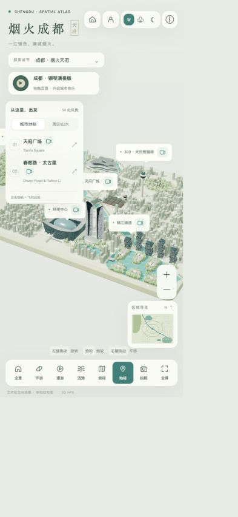
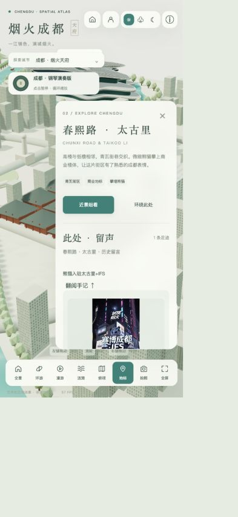
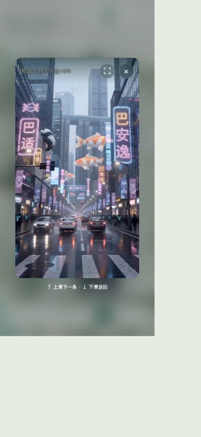

# 城市旅游宝移动端体验审查

2026-09-10。浏览器CSS视口实测393×852，模拟iPhone15竖屏布局；不等同于iOS Safari、真机触摸、动态地址栏、安全区及性能测试。截图工具在当前设备像素比下有缩放呈现，尺寸判断采用DOM实测。此次仅审查与建议，未修改生产。

## 1. 进入全景：拥挤

城市标题、选择器、音乐、账户/首页/昼夜工具、景点列表、缩放、小地图和8项底部工具常驻。米白青绿风格统一，但操作分布于四周，窄屏缺乏主次。建议进入地图时只保留城市胶囊、音乐状态按钮及“探索”圆形按钮。

## 2. 打开景点：详情占据地图

详情DOM宽260px，占393px视口约66%；顶部216px，底部748px，底栏仍在771px附近。留言表单在卡片内部较深处，需要滚动寻找。建议全宽底部抽屉，收起约100px、浏览约45%高度、阅读约85%高度；操作“看手记”“写留言”直接可见。景点列表和详情抽屉互斥。

## 3. 打开手记：主体较集中，但控件仍有冗余

视频窗口比地图页聚焦；38px播放器按钮偏小。DOM显示本应hidden的翻页和字号按钮仍占有矩形，需要修复display样式覆盖hidden的行为。移动端以滑动为主，箭头作为辅助，按内容类型显示控件；建议触摸区域44–48px。

## 建议方案

- 不缩小所有控件，而是响应式重排、折叠低频操作。
- 宽度<768px启用移动布局，768–1023px紧凑平板布局，>=1024px保留桌面布局。矮横屏额外按高度<500px收纳。
- 顶部只留“成都⌄”城市胶囊与音乐开关；底部右侧保留52–56px“探索”圆按钮；首次显示短提示，不做无标识小点。
- 圆按钮打开底部菜单，主项为景点/手记/我的；次级为视角、昼夜、拍照、帮助、返回作品展。一次只开一个面板，不使用环形散射小图标。
- 景点列表全宽抽屉，选中即收起，地图调整相机焦点，避免建筑落在抽屉后。
- 详情抽屉三段高度：约100px、45dvh、85dvh。拖动手柄改变高度，正文区正常滚动，防止两种手势冲突。
- 未选景点的“手记”先引导选择景点；保持既有景点内容范围，不混入全城内容。
- “写留言”在详情抽屉里明确展示，输入键盘出现时隐藏地图工具，保留草稿；游客先登录。
- 暂时收起小地图/缩放按钮/图例/FPS/鼠标说明，地图用双指缩放，仍在工具面板保留替代按钮。
- 标注仅保留当前景点和少数不重叠地标；减少彼此遮挡及小媒体图标误触。
- 使用safe-area-inset和动态视口，文字至少14–16px、主要触摸区域44–48px，尊重减少动态效果设置。

## 验收建议

393×852、375×812、430×932、768宽平板、矮横屏；依次测试选城→选景点→看手记→写留言→收起面板。地图默认无大卡遮挡，所有功能仍可找到；抽屉内部滚动不操作地图；键盘不遮提交；媒体滑动和地图手势不冲突。真机Safari和Android还需各验证一次。
